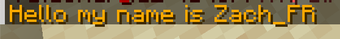
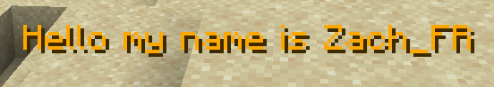
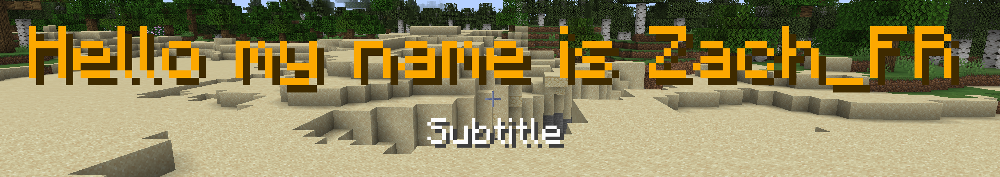

# Type

### CHAT

Example for sending a message in the chat with an unlimited number of lines.

<figure><figcaption></figcaption></figure>

```yaml
# Type of announcement. (CHAT, ACTIONBAR, BOSSBAR, TITLE)
type: CHAT
# Content of announcement.
lines:
  - "&6Hello my name is %player_name%"
```

### ACTIONBAR

Example for sending an action bar message above the inventory.

<figure><figcaption></figcaption></figure>

```yaml
# Type of announcement. (CHAT, ACTIONBAR, BOSSBAR, TITLE)
type: ACTIONBAR
# Content of announcement.
lines:
  - "&6Hello my name is %player_name%"
```

### BOSSBAR

Example for creating a boss bar announcement.

<figure><figcaption></figcaption></figure>

```yaml
# Type of announcement. (CHAT, ACTIONBAR, BOSSBAR, TITLE)
type: BOSSBAR
bossbar:
  # Color of bossbar. (BLUE, GREEN, PINK, PURPLE, RED, WHITE, YELLOW)
  color: RED
  # Style of bossbar. (PROGRESS, NOTCHED_6, NOTCHED_10, NOTCHED_12, NOTCHED_20)
  style: PROGRESS
  # Progress of bossbar. (0.0 - 1.0)
  progress: 1.0
  # Time of bossbar. (1 - 60 seconds)
  time: 5
# Content of announcement.
lines:
  - "&6Hello my name is %player_name%"
```

### TITLE

Example for sending a title with an optional subtitle.

<figure><figcaption></figcaption></figure>

```yaml
# Type of announcement. (CHAT, ACTIONBAR, BOSSBAR, TITLE)
type: TITLE
# Content of announcement.
lines:
  - "&6Hello my name is %player_name%"
  - "Subtitle"
```
